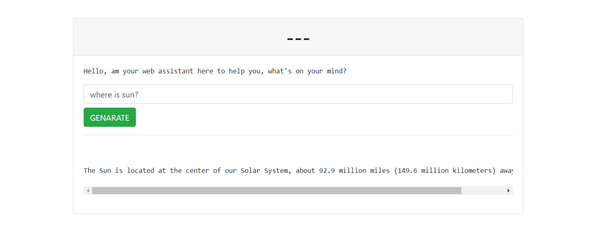

This repository is using OpenAI API to bring chatbot GPT into your django app.



To install and start using:

1) Install python requirements by running <br />
    ``` pip install -r requirements.txt ``` <br />
    in the project root
2) You need to have an openAI API key, which you can get here <br />
    * note that you will need to add a payment method because as of 13/04/23 the API is paid <br />
   https://platform.openai.com/account/api-keys <br />
3) Add your API key to ``` .env ``` file in the root directory
4) Run ``` python manage.py runserver ``` and open server on http://127.0.0.1:8000/


